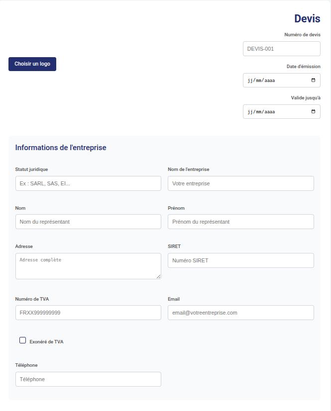
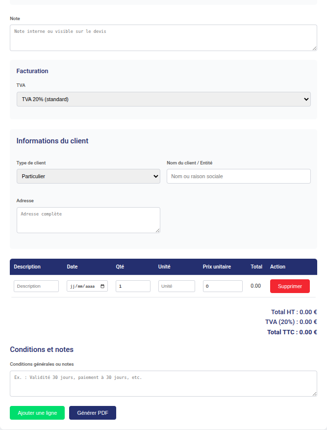
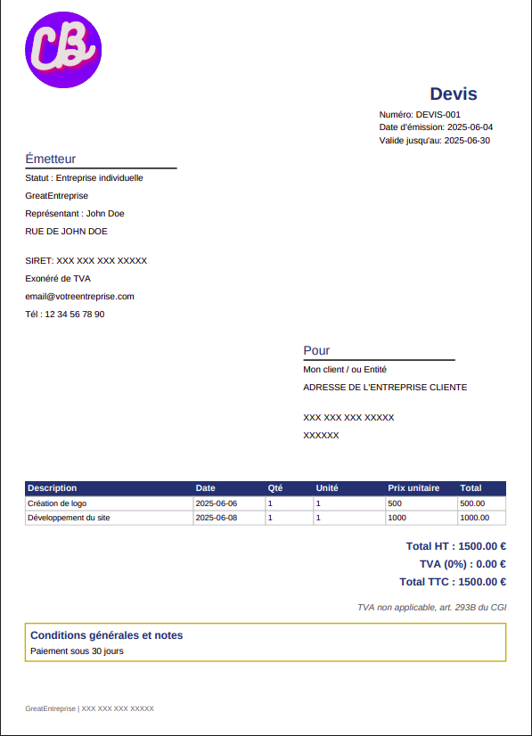

# Générateur de Devis

Une application web pour créer, personnaliser et exporter des devis professionnels en PDF.

## Fonctionnalités principales
- **Saisie intuitive** : Renseignez facilement les informations de votre entreprise et de vos clients.
- **Gestion des lignes de devis** : Ajoutez descriptions, quantités, prix unitaires, et plus.
- **Calcul automatique** : Total HT, TVA (taux personnalisable ou exonération), et TTC.
- **Personnalisation** : Intégrez le logo de votre entreprise pour un rendu professionnel.
- **Export PDF** : Générez des devis avec une mise en page soignée et prête à l'envoi.
- **Responsive** : Utilisable sur ordinateur, tablette et mobile.

 

